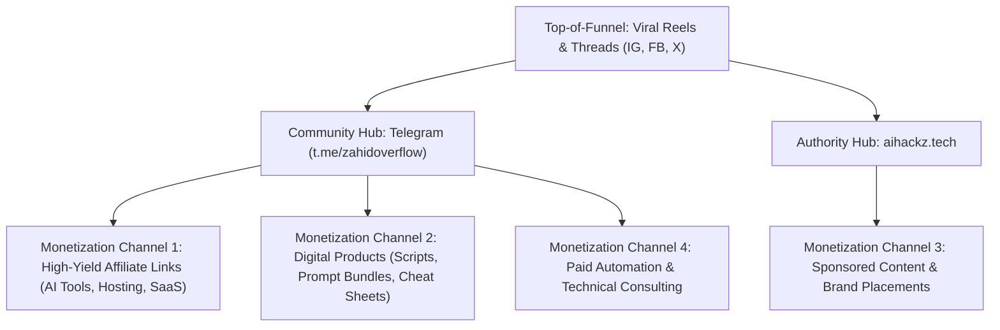

# ⚡ Aihackz | Autonomous AI Content & Monetization Engine

[](https://github.com/zahidoverflow)
[](https://aihackz.tech)
[](https://t.me/zahidoverflow)
[](https://aihackz.tech)

---

## 📌 Executive Overview

**Aihackz** is an autonomous content creation, developer community, and online monetization platform founded by **Zahidul Islam** (`@zahidoverflow`). 

The engine operates directly on **Android (Termux)** using lightweight **Model Context Protocol (MCP)** tools and background daemons to automate:
1. High-retention short-form content research and scripting (Instagram Reels, Facebook Reels, TikTok, YouTube Shorts).
2. Deep-dive technical threads on X (Twitter).
3. Community broadcast and affiliate drops on Telegram (`t.me/zahidoverflow`).
4. SEO-optimized technical guides on [aihackz.tech](https://aihackz.tech).

---

## 🌐 Official Channels & Community

| Channel | Handle / Destination | Role in Funnel |
| :--- | :--- | :--- |
| **Website** | [aihackz.tech](https://aihackz.tech) | Authority Hub, SEO Tutorials, Resource Library |
| **Telegram** | [t.me/zahidoverflow](https://t.me/zahidoverflow) | Core Community, Exclusive Scripts, Affiliate Deals |
| **Instagram** | [@zahidoverflow](https://www.instagram.com/zahidoverflow) | Viral Top-of-Funnel Reels ([Sample Reel](https://www.instagram.com/reel/DeCDVDOsz6F/?stkn=bG5vemFtMzBtdzA=)) |
| **X (Twitter)** | [@zahidoverflow](https://x.com/zahidoverflow) | AI Industry Insights & Viral Threads ([Sample Post](https://x.com/zahidoverflow/status/2106375615142400492)) |
| **Facebook** | [@zahidoverflow](https://www.facebook.com/zahidoverflow) | Cross-posted Short-form Video ([Sample Reel](https://www.facebook.com/share/r/1eWZwLoLrX/)) |

---

## 🛠️ Safe Termux MCP Tools for Online Monetization

All tools are configured to run safely on rooted Android without altering kernel parameters, risking bricking, or causing hardware degradation.

| Tool Name | Type | Key Monetization Capabilities | Resource Profile |
| :--- | :--- | :--- | :--- |
| **`termux-browser`** | Browser CDP | Multi-platform post scheduling, competitive trend research, lead extraction | <10MB RAM bridge, attaches to existing Chrome |
| **`telegram-broadcaster`** | Bot API | Broadcasts daily AI tips, affiliate deals, and digital product drops to `t.me/zahidoverflow` | <15MB RAM, standard Python HTTPS |
| **`content-pipeline`** | LLM Engine | Generates viral 3-second hook scripts, X thread carousels, and Markdown articles | On-demand CPU, zero idle overhead |
| **`github-syncer`** | Version Control | Real-time automated backup and synchronization with GitHub private remote | Transient subprocess (<1s) |

---

## 💰 The Aihackz Monetization Blueprint



---

## ⚡ Quickstart & Operations

```bash
# Sync local changes immediately with private GitHub repository
bash scripts/sync.sh once

# Run continuous 24/7 background sync daemon (every 10 minutes)
bash scripts/sync.sh daemon 600

# View current git status
bash scripts/sync.sh status
```
